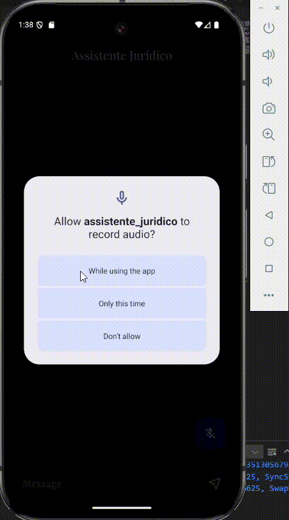

# Assistente Jurídico

**Autor:** [Seu Nome Aqui]

## Descrição do App

O **Assistente Jurídico** é um aplicativo Flutter que utiliza inteligência artificial para responder perguntas relacionadas ao direito civil. Ele foi projetado para ajudar usuários leigos a entenderem termos jurídicos de forma clara e objetiva, evitando jargões e fornecendo informações úteis.

## Imagens do App

### Aplicativo Rodando


## Tecnologias Utilizadas

- **Flutter**: Framework para desenvolvimento multiplataforma.
- **Google Generative AI**: Modelo de linguagem utilizado para gerar respostas.
- **flutter_dotenv**: Gerenciamento de variáveis de ambiente.
- **speech_to_text**: Reconhecimento de voz para entrada de comandos.
- **flutter_tts**: Conversão de texto em fala.

## Instruções de Instalação e Execução

1. **Pré-requisitos**:
   - Flutter instalado ([guia de instalação](https://docs.flutter.dev/get-started/install)).
   - Chave de API do Google Generative AI.

2. **Clone o repositório**:
   ```bash
   git clone <https://github.com/edgargavioli/aplicativo_juridico>
   cd aplicativo_juridico
   